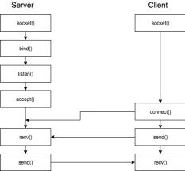
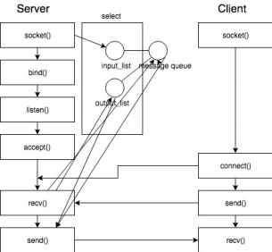

# ComputerNetwork
TCP-based Multiuser Chat Application 
2018 

### Introduction
--------------------------------
: This application is programmed in Python3.6.5 on Ubuntu (Linux x86_64). The purpose is to
understand TCP socket programming and multiplexing by developing server-client architecture
and sending messages between sockets.

### Main Socket Functions
---------------------------
: Python standard library provides a ‘socket’ module. Socket module provides low level
networking interface. It has 8 main functions within client and server.

#### 1) socket(socket.AF_INET, socket.SOCK_STREAM)
- First to create a socket, ‘socket’ function is used. It accepts two parameters (family, type),
which has to be (socket.AF_INET, socket.SOCK_STREAM) to make a TCP socket.
#### 2) setsockopt(socket.SOL_SOCKET, socket.SO_REUSEADDR, 1)
- This function shows the specification of created socket. Parameter socket.SO_REUSEADDR
specifies that the rules used in addresses binded by bind() should allow reuse of local
addresses.
#### 3) Select([],[],[])
- We use this function to avoid multi-thread programming and still make the application
able to run while it reads from or writes to a socket. The program can therefore listen for
server message and user input from multiple users. Select function asks the OS to check the
sockets whether they are readable, writable or in exceptional situation. So the program
should append sockets that are readable, writable or in exceptional error to three lists that
are put in as parameters. further explanation about what ‘readable’, ‘writable’ socket it will
be continued with the diagram below.
We use select function to allow multiple clients. It can also be done by using
multithread programming, but creating large number of threads and switching messages
between them is not a cheap method. Especially when there can be large number of clients,
using select function makes switching much easier and cheaper. However, select function
requires very different style of programming from existing single thread applications. Also it
requires big attention to avoid using any blocking functions since it can paralyze the whole
system. It takes individual time for reading and managing each data, so it is not good for
applications that need to manage huge data at once.
#### 4) Bind(“0.0.0.0”, 7777)
- After we create a server socket, this function binds the socket to given port number.
#### 5) listen(5)
- This function listens from incoming connections. Listen(5) means that the application wants
to queue up to maximum 5 connections before it refusing outside connections.
#### 6) Connect()
- This function is used in client program, and connects the socket to given server socket
address.
#### 7) Accept()
- After binding server with bind() function, this function accepts an incoming connection. It
creates a new socket and returns it with the client’s address.
#### 8) Close()
- This function simply closes the socket.

### How it works
------------------

Above is a block diagram about how server-client architecture works on basic TCP chat
program. After creating a socket and binding it to a given address, server listens for an
incoming connection. Client creates a socket and connects to server socket. After the socket
is connected, client sends a data by send() as a request of communication. Server socket
receives the data by the recv() function and sends it back to the client as a reply of
communication.

To accept multiple users, select function is applied in this application – and it gets a
bit trickier. Whenever the socket is newly connected, the socket is appended to an ‘input’ list,
which lists all the connected sockets. If the socket is connected, it has its own message[]
queue that saves data that are sent from. The new connection is broadcasted to all sockets
inside input list, otherwise then itself.    
If something came into the socket, use recv() function and check if it is a message or
a closure. If it is a data, we append the socket to output list since it has something to be sent,
and broadcast other clients about the news. Else if the socket is closed, socket is removed
from both input and output list and it is broadcasted to all the connected sockets that it left.
Secondly we check the output list, which is a list of sockets that are writable. It means
that they have something to send. If there is a data left in message[] queue indexed by the
socket’s address, we immediately put data into a variable next_msg. If the queue is empty, the
socket is removed from the output list. The data is sent to the client. Queue is used because
the data cannot have infinite size, instead it can be divided into packets and be organized as
a queue.    
Lastly, if the socket fell into some kind of exceptional situation, the socket is removed
from both input and output list, and is closed.
In a client application, if server socket is in readable list, it means that server sent
something so the client has to print it. If stdin is readable, it means the user typed something
pressed enter key, so it should be sent to server as a message data. Client socket receives the
data from the server socket and if the data is valid, it prints out what it has received. If the
data is not valid or if it is a newline, the connection is refused.    
In addition, I used ‘Termios’ library to control interface of linux prompt. When the
client enters a message, ‘[You]’ is printed once and blocked. Since it is blocking echo and
using try~except~finally to call back the old copy, the data is printed only once and what the
user wrote on prompt is safely called back. Also when client enters Ctrl+C, Termios makes it
possible to avoid printing out ^C by copying the state before transformation.
